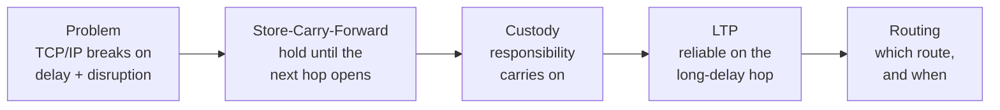

<div align="center">

# Communication Under Extreme Delay & Disruption: Delay-Tolerant Networking

**2026 Computer Networks · Team Project · Group 1**

Talk: https://youtu.be/EiZ8PTVzcZA &nbsp;·&nbsp; Live deck: https://dongjinka.github.io/2026-computer-network/

[Overview](#overview) · [Presentation](#presentation) · [Reproduce the demo](#reproducing-the-demo) · [Structure](#repository-structure) · [Team](#team)

</div>

---

## Overview

TCP/IP quietly assumes one thing: an unbroken end-to-end path that exists *right now*. Push
communication to its limit — a rover on Mars, minutes of one-way delay, links that drop for
hours — and that assumption falls apart.

- **The problem** — TCP/IP breaks under long delay and disruption: no continuous path (the
  handshake never completes), minute-scale RTT, and physical bit-errors mistaken for congestion.
- **The answer** — Delay-Tolerant Networking holds data and forwards it when the next hop opens
  (*store-carry-forward*), hands off responsibility hop by hop (*custody*), over the Bundle
  Protocol v7 (RFC 9171).
- **The proof** — we build NASA JPL's **ION-DTN**, fake a 600-second Earth–Mars delay with its
  `owltsim` tool, and watch one bundle survive a dead link, in running code.
- **When not to use it** — on stable, low-latency links plain TCP/IP wins; DTN is a net loss there.

One bundle's journey, and the mechanism that answers each stage:



Full walkthrough: the talk, and **[DEMO.md](DEMO.md)**.

## Presentation

- **Recording (29:32):** https://www.youtube.com/watch?v=EiZ8PTVzcZA
- **Live deck:** https://dongjinka.github.io/2026-computer-network/

The deck lives in `presentation/`:

| Format | File |
|--------|------|
| Slides (PDF) | `presentation/CN_Group1_Communication Under Extreme Delay & Disruption_DTN.pdf` |
| Web deck | `presentation/CN_Group1_Communication Under Extreme Delay & Disruption_DTN.html` |
| Editable source (Marp) | `presentation/presentation.md` |
| Speaker script | `presentation/presentation_script.md` |

Re-render with `marp presentation.md --pdf`, or the *Marp for VS Code* extension.

## Reproducing the demo

`src/` pins `nasa-jpl/ION-DTN` at commit `e9863023e` (the `integration` branch, ION 4.2.0-a.1
lineage) as a submodule — referenced, not copied in. Don't run `git submodule update --remote`;
it would advance the moving branch.

```bash
git clone --recurse-submodules https://github.com/dongjinka/2026-computer-network.git
git submodule update --init --recursive      # if you already cloned
```

The demo configs (two nodes, 600 s delay) are checked into [`demo/`](demo/). Then follow
**[DEMO.md](DEMO.md)** to build ION and run the test.

## Repository structure

```
2026-computer-network/
├── presentation/   Slides, research, Q&A prep, and the Marp source — our deliverables
├── docs/           Web deck served by GitHub Pages (Deploy from a branch → main /docs)
├── demo/           ION demo configs for the two-node, 600 s delay test
├── src/            NASA JPL ION-DTN — git submodule, reference only
├── DEMO.md         How to reproduce the ION-DTN demo
├── LICENSE         CC BY 4.0 (original materials)
└── README.md
```

## Team

2026 Computer Networks — Group 1

| Member | Focus | Key question |
|--------|-------|--------------|
| Jaewon Kim (김재원) | TCP/IP limits | Why does TCP/IP break under extreme delay? |
| Seojun Park (박서준) | DTN architecture and mechanisms | How does DTN's structure solve it? |
| Dongjin Ka (가동진) | ION-DTN and real-world cases | How is DTN implemented and used? |

## References

- RFC 9171 — Bundle Protocol Version 7 · https://www.rfc-editor.org/info/rfc9171
- RFC 4838 — Delay-Tolerant Networking Architecture · https://www.rfc-editor.org/info/rfc4838
- RFC 5326 — Licklider Transmission Protocol · https://www.rfc-editor.org/info/rfc5326
- NASA JPL ION-DTN · https://github.com/nasa-jpl/ION-DTN

The full source list is on the deck's closing slide (`presentation/presentation.md`).

## License & attribution

- **Original materials** (slides, research, web deck, demo configs) — CC BY 4.0, see [LICENSE](LICENSE).
- **ION-DTN** (`src/`) — a separate NASA JPL project under its own license; referenced as a
  submodule, not redistributed. https://github.com/nasa-jpl/ION-DTN
- **Font:** Pretendard, SIL Open Font License.
